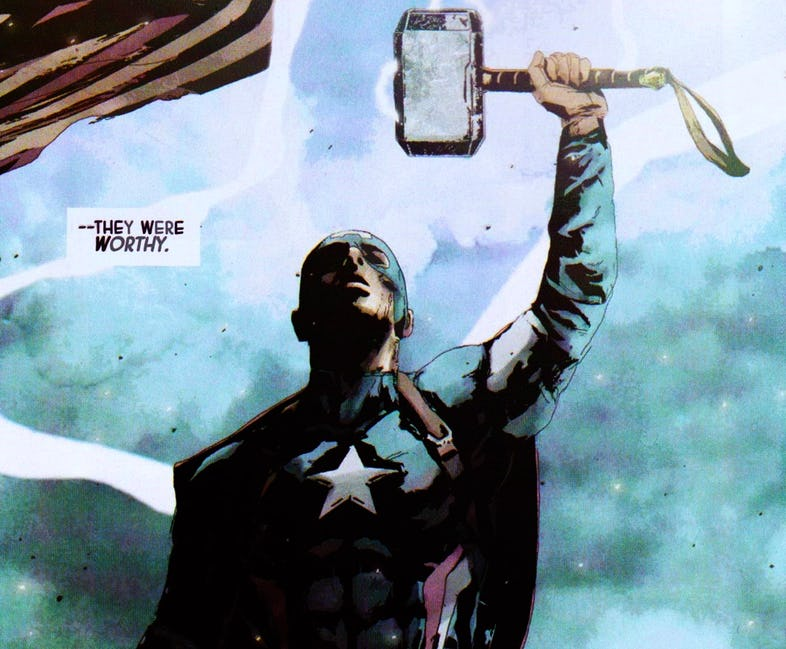

## New Beginnings 
Prior to taking ICS 212 I had learned JavaScript, HTML, CSS, and Java in middle school and my first semesters in University. Admittedly, I did not truly take my JavaScript knowledge into practice in my middle school and highschool years, but have found it incredibly refreshing to come back to it. This is a little embarrassing to say, but up until my first semester of college I didn’t even know that Java and JavaScript were two different languages. Now that I have relearned the basics of JavaScript and have had the opportunity to use Java in practice, I can say without any hesitation that JavaScript is superior!

## JavaScript Is Worthy
After relearning the basics of JavaScript the difference between the Java was like before and after the audience knew that Steve Rogers was worthy enough to wield Mjölnir, the MCU was simply just better. JavaScript was born from ideas that were more interesting and therefore allows more flexibility to the programmer. One example of this is how functions are treated as first class objects. By extension, programs and code become more simple and concise. The possibilities that this adaptability provides is endless and protects the sanctity of a project as a passion. The programmer can enjoy their time on the project without allocating time worrying about the proper syntax, class hierarchies, and bothersome minute details that languages like Java have. Moreover, Object Oriented programming is no longer as tedious due to the grace of JavaScripts variable and function properties(e.g. creating variables that can take on more than one data type). Lastly, the ease of language evolution is amazing due to its ability to adapt newer features to older ones. I personally found that learning ES6 was a little confusing at first but I appreciate the features that provide shortcuts in the language that have allotted me the opportunity to have shorter and concise code. It is no wonder that the JavaScript ecosystem has cultivated such large and fast growing support. 

## Leg Day + Brain Day = YES!
I love leg / glute day just as much as the next girl, but it is also important to take care of our minds as well. One thing I do everyday is play Sudoku, Killer Sudoku, and Chess everyday. One thing that I find worth adding to that list is solving coding problems. The athletic software engineering approach (Workout of the Day - WODs) used in this course is a great because it grants me the ability to use my problem solving skills and programing knowledge to solve a problem under a time sensitive environment, simulating how I would have to look at an obstacle in the real world and find an approach using my knowledge of algorithms, mathematics, and programming. So far I have enjoyed being able to test my skills and build up the confidence for upcoming interviews for internships and eventually jobs. The WODs in combination with my time in clubs like PANDA aid me in enhancing my abilities and push me to become a better programmer. 
