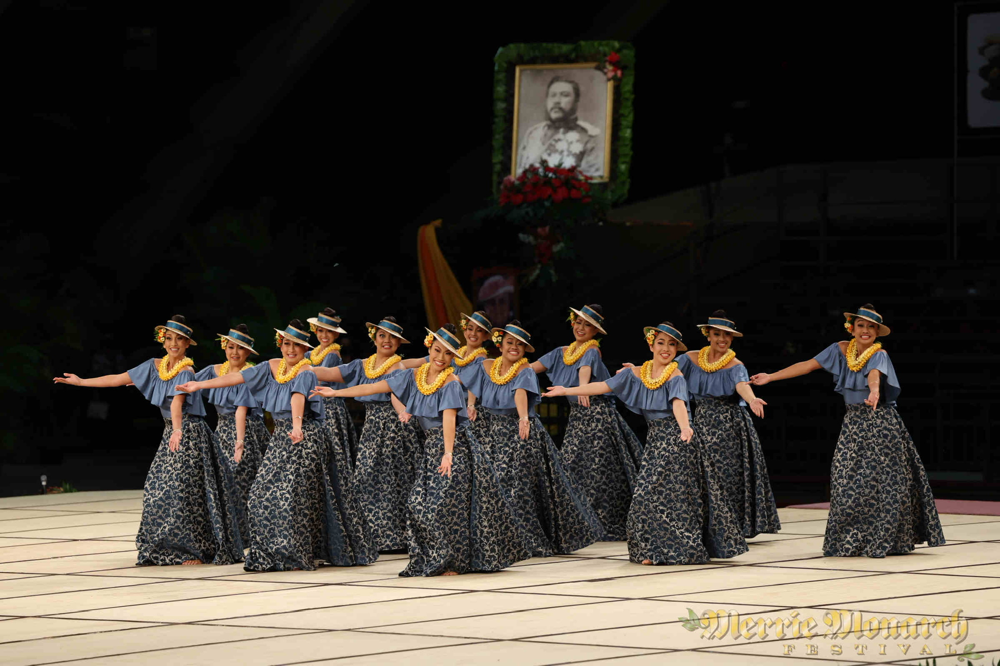
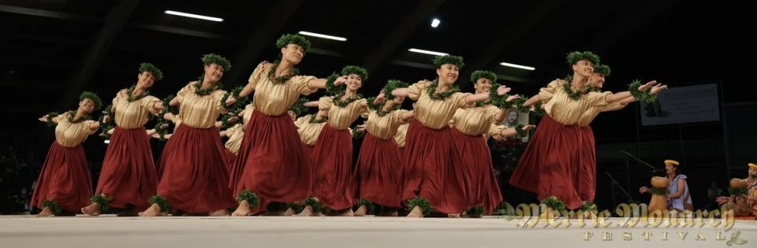
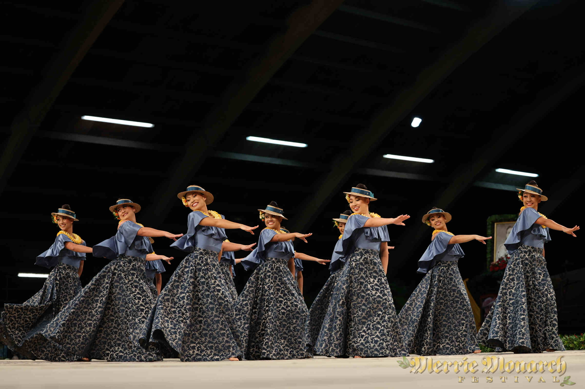

## The Gem of the Code
Much like in the beginning of my hula career, my beginnings in web / app development were very vague. I only ever saw the finished product of a person's blood, sweat, and tears through a simple performance or a web application. It wasn't until I started my journey in both of these paths that I realized the tumultuous process that would await me. So what is a design pattern anyways? Upon first glance I thought it quite literally was just the visual aspect of a web application; the font, the colors, the vibezzz. However, after further inspection and implementation I have come to learn that it pertains more to the design of the code and how it best fits a particular project. As Christopher Alexander puts it, a design pattern describes some sort of problem in our environment that occurs many times, but we can come up with a solution that can be used over and over, without doing it the same way twice. No two projects, people, or environments are the same or meet the same criteria, design patterns can be used to tackle each individual problem in the most efficient and suitable way. 

## Interpretation and Visualization

Much like in hula, no two hālau, kumu, or lineages of hula will choreograph a song the exact same way. In my progression in my own hula life I have been able to build an eye to pick out the different characteristics of different hula lineages and hālau through the way they chant, give expression, and dance. It is especially fun to see how different kumu have interpreted a song through their choreography based on their own training compared to my own kumu. My hālau in particular uses very exaggerated, controlled, and sassy movement built into our dances. Regardless of who you dance for, there is no question that the movements must convey the sentiments of the song, the story, and the artist. 

The topic of design patterns parallels this concept perfectly. In our daily lives there are always many issues to tackle and it is up to the coder to figure out the best possible approach for each of these issues according to the mission of the project. Understanding design patterns can also help elevate our code for better efficiency, legibility, or simplicity. For example instead of using a string of if / else statements one could use a switch statement. Or more infamously we want to choose the most efficient algorithm for the traveling salesman problem. 

## Sharing a story

The goal of hula is to share a story through movements, to portray the sentiments of the moʻolelo to the audience even if they don't understand a single word of the mele. Similarly design patterns help with the legibility of the code and shows the thought process of the coder, their calculated decisions reflected in their work. Because the purpose of design patterns is to provide a utilitarian and repeatable solution to issues, clarity of these two properties in code is of the utmost importance for the coder and future coders who may work on the same project or use it as inspiration. 

In my own final project my team is thinking of implementing a filter and like system for the “top choices” (top food vendors on campus). Which aligns with the observer design pattern. More specifically the observer design pattern has a subject, observer, and client. If the subject experiences any changes then the dependent observers are notified.  This design pattern is useful as it implements a one-to-many relationship with less hassle. 
