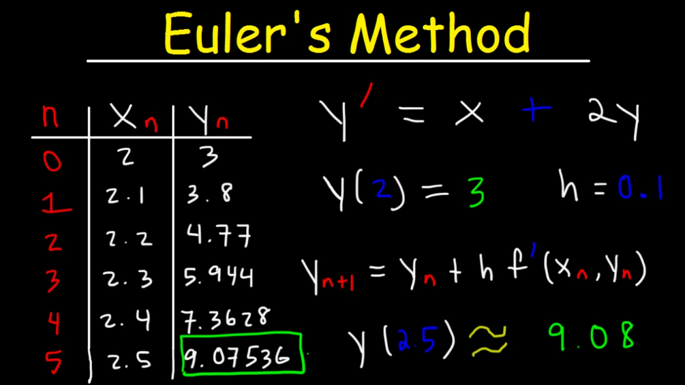
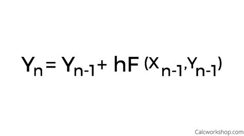
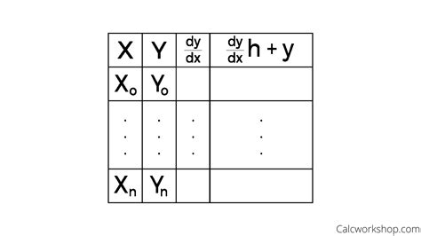

<div class="ui small rounded images">
  
  
  
  
</div>

This project was really one of the first times I had used code for a practical real world reason and it reignited my passion for software engineering and coding in general. It felt really good to able to see the merit of my labor and knowledge learned in class to able to solve even the smallest problems. This small project in particular was even more so amusing because I love Math and it allowed me to experiment and have fun with coding. Although this is a very low level simple project I thought it was worth discussing because its small projects like this that spark or respark interests in coding and remind me that ultimately I code to solve problems. Ofcourse projects can be elevated but the prospects that this concept present are what creates incredible programs in the modern world.

For this project, I worked with a few friends as a fun joke. However, it proved to be quite useful and it helped us practice our team work skills. We corroborated our ideas on how the program should be made, what methods to create, how to create an efficient program i with the knowledge of Java we had so far, etc., simulating a work setting most likely to occure in an actual office. Overall, this project was a simple and fun yet effective way to practice coding. 

Here is the basic code that we used for this fun little project:

```java
// Euler's Method for Differential Equation
import java.io.*;

public class EulerMethod {
   // Consider a differential equation
   double func(double x, double y)
   {
       /* Put formula here (if you need to do something like 15x^2 - 3x^2y, 
        * plug it in like this: ((15 * (x * x)) - ((3 * (x * x)) * y))
        */
       return ((15 * (x * x)) - ((3 * (x * x)) * y));
   }

   // Function for Euler formula
   void euler(double x0, double y, double h, double x)
   {
       double temp = 0;

       // Iterating till the point at which we need approximation
       while (x0 < x) {
           temp = y;
           y = y + h * func(x0, y);
           x0 = x0 + h;
       }

       System.out.println("Approximate solution at x = " + x + " is " + y);
   }
   
   public static void main(String args[]) throws IOException
   {
       EulerMethod obj = new EulerMethod();
       // Initial Values (Subject to change based on the problem)
       double x0 = 0;
       double y0 = 7;
       double h = 0.001;

       // Value of x at which we need approximation (subject to change based on the problem)
       double x = 1;

       obj.euler(x0, y0, h, x);
   }
}  return ADC1RL;  // lower 8-bit value out of 10-bit data from the ADC
}
```


